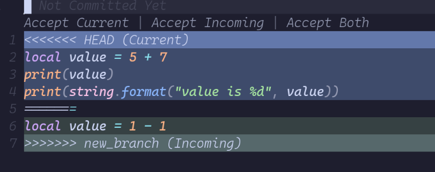

# conflict.nvim

_A simple NeoVim plugin to resolve merge conflicts with ease._

This plugins is inspired by the no longer maintained
[git-conflict.nvim](https://github.com/akinsho/git-conflict.nvim). I initially
started this as a fork but ended up as a complete rewrite from scratch with a
much simpler codebase.



## Installation

Using [lazy.nvim](https://github.com/folke/lazy.nvim):

```lua
{
    "niekdomi/git-conflict.nvim",
    opts = {
        -- your configuration here
    }
}
```

## Configuration

> [!CAUTION]
> The default mappings start with `c` (e.g., `cc`). This will introduce a delay
> to the built-in **change** operator. If you prefer to keep the default Neovim
> behavior, remap these or set them to `false` to disable them.

The following example shows the available options with their default values:

```lua
require("conflict").setup({
    default_mappings = {
        current = "cc",
        incoming = "ci",
        both = "cb",
        next = "]x",
        prev = "[x",
    },
    show_actions = true,        -- Show clickable [Accept Current | ...] labels
    disable_diagnostics = true, -- Disable LSP/Diagnostics while conflicts exist
    highlights = {
        current = "DiffText",
        incoming = "DiffAdd",
    },
})
```

## Commands

| Command              | Description                            |
| :------------------- | :------------------------------------- |
| `:Conflict current`  | Keep the **current** (local) changes   |
| `:Conflict incoming` | Keep the **incoming** (remote) changes |
| `:Conflict both`     | Keep **both** sections                 |
| `:Conflict next`     | Jump to the next conflict              |
| `:Conflict prev`     | Jump to the previous conflict          |
| `:Conflict refresh`  | Manually re-parse the buffer           |

### Mouse Support

If `show_actions` is enabled, you can **left-click** the virtual text labels
(e.g., `Accept Current`) directly above a conflict block to resolve it
instantly.
